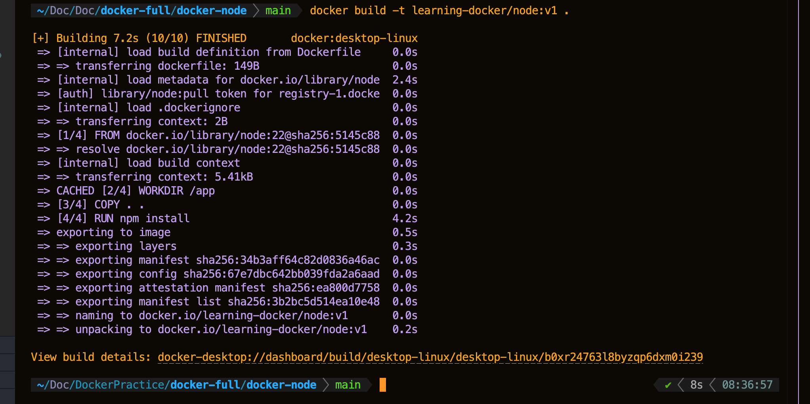
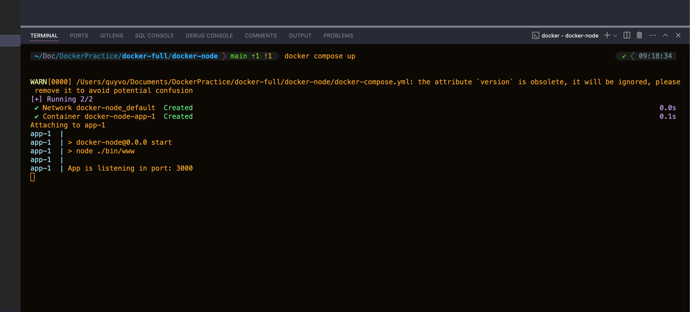

# FOR DEV
### 1. Create Dockerfile with the following content:
```
FROM node:22

WORKDIR /app

COPY . .

RUN npm install

CMD ["npm", "start"]
```

### 2. Build Docker Image
docker build -t <image_name>:<tag> .

```
docker build -t learning-docker/node:v1 .
```

### 3. Create file docker-compose.yml
With content:
```
version: "3.7"

services:
  app:
    image: learning-docker/node:v1
    restart: unless-stopped
```

### 4. Run docker image
```
docker compose up

```


